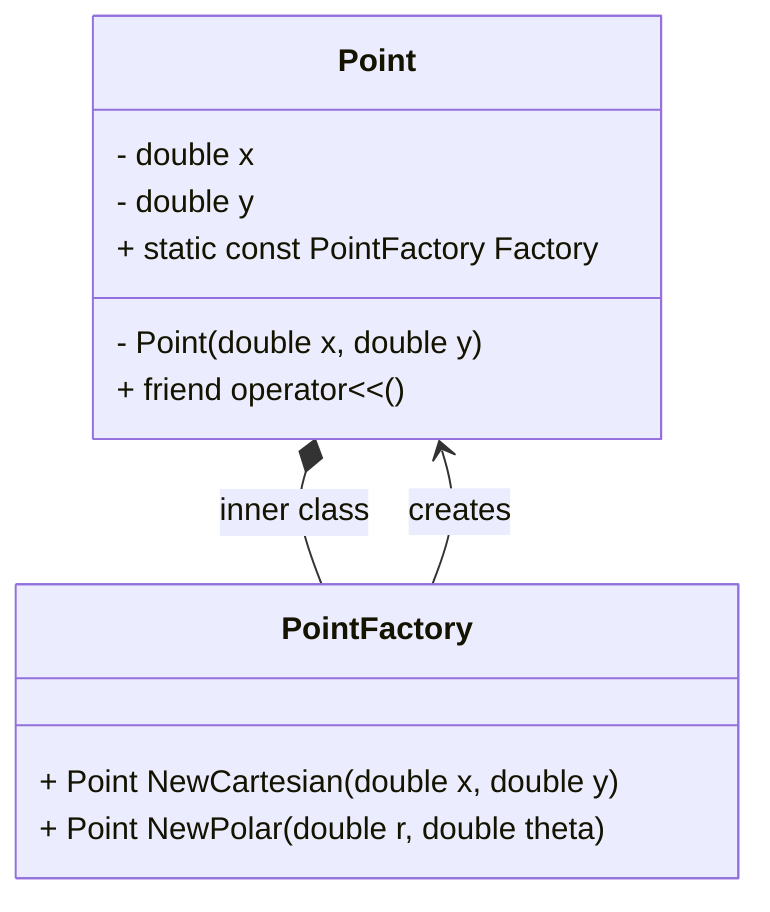
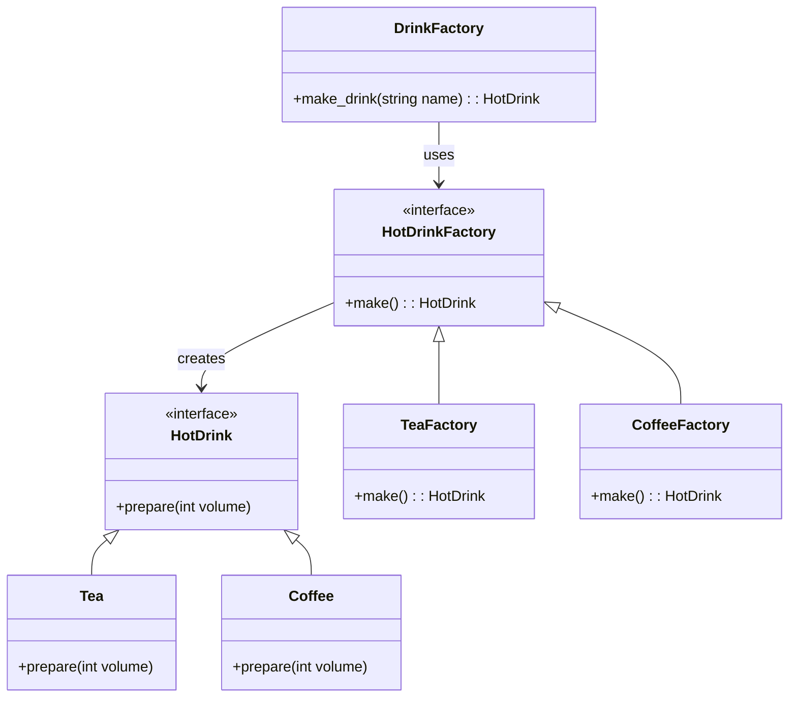
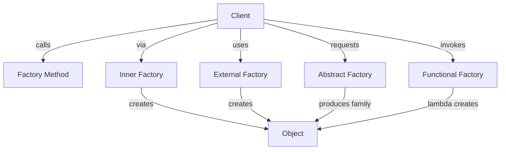

# The Factory Design Pattern: Prelude

Before we dive into the different **Factory Design Patterns**, let’s first look at an example where a **factory** is actually relevant and useful.

---

## **🧩 Problem Setup: Representing a 2D Point**

Imagine that we want to build a structure representing a **two-dimensional point**.

A Point has:

- an x coordinate
- a y coordinate

So, we could start with a simple structure like this:

```cpp
struct Point
{
    double x, y;

    Point(double x, double y)
        : x{x}, y{y} {}
};
```

✅ This constructor works fine for **Cartesian coordinates** (x, y).

---

## **📐 Polar Coordinates Initialization Problem**

Now suppose we also want to **initialize a Point using polar coordinates**:

That is, using ρ (rho, the distance from the origin) and θ (theta, the angle).

Our first idea might be to add another constructor:

```cpp
// ❌ Invalid idea in C++
Point(double rho, double theta);
```

But in **C++**, you **cannot** have two constructors that take the same number and type of arguments (double, double in this case).

> [!tip] 🧠 **Reason:**
> The compiler cannot distinguish between (x, y) and (rho, theta) because both are double, double.

## **🧱 Attempt: Use an Enum to Indicate Coordinate Type**

One workaround is to define an enum class describing the coordinate system type:
  
Additionally, constructor names in C++ **must** match the class name (Point), so we can’t name it something like `PointFromPolar`.

```cpp
#include <cmath>

struct Point {
    double x, y;

    enum class PointType {
        Cartesian,
        Polar
    };

    Point(double a, double b, PointType type = PointType::Cartesian) {
        if (type == PointType::Cartesian) {
            x = a;
            y = b;
        } else {
            // Polar to Cartesian conversion
            x = a * std::cos(b);
            y = a * std::sin(b);
        }
    }
};
```

So now we are able to create `Point` objects like:

```cpp
Point p1{2, 3};  // Cartesian
Point p2{2, M_PI / 4, Point::PointType::Polar};  // Polar
```

## **😕 But There’s Still a Problem…**

This approach **works**, but it’s not **clear** or **expressive**.

If you see this:

```cpp
Point p{2, 3, Point::PointType::Polar};
```

> [!question]
> “Is 2 the angle or the distance? What does 3 represent?”

Even if we document parameters like this:

```
/// @param a Either x or rho
/// @param b Either y or theta
```

…it’s still **confusing and error-prone**.

## **💡 What We Really Want**

Ideally, we’d like to write something like:

```cpp
auto p1 = Point::FromCartesian(2, 3);
auto p2 = Point::FromPolar(2, M_PI / 4);
```

This syntax is:
- **Clear** — we know exactly what each parameter means.
- **Safe** — there’s no ambiguity about the coordinate system.
- **Expressive** — the interface communicates intent immediately.

## **🏭 And That’s the Point (Pun Intended)**

This is **exactly what the Factory Pattern is about**.

It helps create objects using **named construction methods** that are:
- **Intuitive** for clients
- **Clear** in meaning
- **Flexible** in implementation

Instead of forcing object creation through constructors, we expose **factory methods** that make intent explicit.

## **✅ Summary**

> ⚙️ **Problem:**
> Constructors can’t express multiple creation modes clearly, especially when argument types are the same.

> 🏗️ **Solution:**
> Use **named factory methods** (e.g., FromCartesian, FromPolar) to clearly describe object creation.

> 💬 **Result:**
> Clean, understandable, and maintainable code — the essence of the **Factory Pattern**.

### **💻 Example Preview**

Here’s what we’ll soon evolve toward using a **factory method** approach:

```cpp
struct Point {
    double x, y;

private:
    Point(double x, double y) : x{x}, y{y} {}

public:
    static Point FromCartesian(double x, double y) {
        return {x, y};
    }

    static Point FromPolar(double rho, double theta) {
        return {rho * std::cos(theta), rho * std::sin(theta)};
    }
};

auto cart = Point::FromCartesian(3, 4);
auto polar = Point::FromPolar(5, M_PI / 3);
```

# **🏭 Factory Method**

In the previous section, we discussed the limitations of constructors when initializing a class in multiple ways — for example, creating a Point either from **Cartesian** or **Polar** coordinates.
  

Now we’ll see how to mitigate those issues using the **Factory Method Design Pattern**.

---

## **💡 The Core Idea**

The **Factory Method** shifts **object initialization** away from constructors and into **static member functions** (methods).

These functions create and return instances of the class, offering clear and meaningful names such as:

```cpp
Point::NewCartesian(...)
Point::NewPolar(...)
```

This improves **readability**, **maintainability**, and **encapsulation**.

## **🧱 Step 1 — Move to a Class and Encapsulate the Constructor**

We’ll start by changing our struct to a class and make its constructor **private**.

This way, clients cannot directly instantiate Point using the constructor — they must use one of our **factory methods**.

```cpp
#include <iostream>
#include <cmath>

#define _USE_MATH_DEFINES  // Enables M_PI constant on Windows

class Point {
	public:
	    double x, y;
	
	private:
	    // Private constructor – only accessible inside the class
	    Point(double x, double y)
	        : x{x}, y{y} {}
	
	public:
	    // ✅ Factory Method #1: Create from Cartesian coordinates
	    static Point NewCartesian(double x, double y) {
	        return {x, y};
	    }
	
	    // ✅ Factory Method #2: Create from Polar coordinates
	    static Point NewPolar(double r, double theta) {
	        return {r * std::cos(theta), r * std::sin(theta)};
	    }
	
	    // 📤 Optional: stream output for debugging
	    friend std::ostream& operator<<(std::ostream& os, const Point& p) {
	        return os << "x = " << p.x << ", y = " << p.y;
	    }
};
```

## **🧩 Step 2 — Use the Factory Methods**
  
Because the constructor is **private**, you cannot do this anymore:

```cpp
// ❌ Error: constructor is private
Point p(3, 4);
```

Instead, you use one of the static factory methods:

```cpp
// ✅ Construct using Cartesian coordinates
auto p1 = Point::NewCartesian(3, 4);

// ✅ Construct using Polar coordinates
auto p2 = Point::NewPolar(5, M_PI / 4);

std::cout << "Cartesian point: " << p1 << '\n';
std::cout << "Polar point (converted): " << p2 << '\n';
```

## **🧠 What’s Happening Under the Hood**

When the factory method returns { ... }, it uses **C++’s uniform initialization syntax**,
which deduces the return type automatically:

```cpp
static Point NewCartesian(double x, double y) {
    return {x, y};  // returns Point{x, y}
}
```

So the expression {x, y} constructs a Point internally — even though the constructor is private — because the method is a **member** of the class and has access to it.

---

## **🚫 Why Not Just Use the Constructor?**

Because we now have:
- **Encapsulation** — the internal representation of the point `(x, y)` *stays hidden*.
- **Clarity** — the interface tells you _exactly_ what kind of point you’re creating.
- **Safety** — clients can’t misuse the constructor or mix coordinate systems by mistake.

## **✅ Summary**

> [!note]
> **The Factory Method Pattern** allows object creation through **named static methods** rather than constructors.

> [!tip]
> This offers more control, clarity, and flexibility in how objects are initialized.

## **🧩 Key Takeaway**

==Factory methods== let you name your object creation routines explicitly, making your code **clear**, **safe**, and **self-documenting**.

# **🏭 Factory (Dedicated Factory)**

In the previous section, we implemented the **Factory Method Pattern** by embedding static creation functions (NewCartesian, NewPolar) directly inside the Point class.

However, in some cases, you may want even **greater separation of concerns** — keeping construction logic **outside** the class being created.

That’s where a **dedicated Factory class** comes into play.

---

## **🧩 Motivation**

If you already have specialized logic for constructing objects, it can make sense to move it into a **separate component**.
  
So instead of having creation methods _inside_ the Point class, we’ll extract them into a new structure:

```cpp
struct PointFactory {
    // ... methods for creating Points
};
```

This separates **object construction** from **object representation**, leading to cleaner design and better modularity.

## **🧱 Step 1 — Moving Creation Logic into a Factory**

Let’s start from our existing Point class (from 4.3) and move the static methods out of it.
### **Point class**

```cpp
#include <iostream>
#include <cmath>

class Point {
public:
    double x, y;

private:
    Point(double x, double y)
        : x{x}, y{y} {}

    // 👇 Allow PointFactory to access private members
    friend class PointFactory;

public:
    friend std::ostream& operator<<(std::ostream& os, const Point& p) {
        return os << "x = " << p.x << ", y = " << p.y;
    }
};
```

### **PointFactory class**

```cpp
struct PointFactory {
    static Point NewCartesian(double x, double y) {
        return {x, y};
    }

    static Point NewPolar(double r, double theta) {
        return {r * std::cos(theta), r * std::sin(theta)};
    }
};
```

Now, the factory class PointFactory is **responsible** for creating Point instances.

## **⚙️ Step 2 — Using the Factory**

The client code now becomes very expressive:

```cpp
int main() {
    auto p1 = PointFactory::NewCartesian(3, 4);
    auto p2 = PointFactory::NewPolar(5, M_PI / 4);

    std::cout << "Cartesian point: " << p1 << '\n';
    std::cout << "Polar (converted): " << p2 << '\n';
}
```

## **🧠 Access Control and the Open/Closed Principle**

There’s one design caveat here.

Because the `Point` constructor is private, `PointFactory` cannot access it unless we declare it as a ==**friend class**==:

```cpp
friend class PointFactory
```

However, this **violates the Open/Closed Principle (OCP)**.

> [!tip]
> 🔍 **OCP Reminder:**
> _Software entities should be open for extension, but closed for modification._

Why is this a problem?

- The moment we introduce a factory, we must **modify** the existing `Point` class to add the friend declaration.
- If the Point class had been stable and released for months, we’ve now broken encapsulation to support a new feature.

---

## **⚖️ Step 3 — Alternatives**

If you want to **preserve OCP**, there are two main alternatives:

### **✅ Option 1: Make the constructor public**

If the constructor is **public**, the factory doesn’t need special privileges.

```cpp
class Point {
	public:
	    double x, y;
	
	    Point(double x, double y)
	        : x{x}, y{y} {}
	
	    friend std::ostream& operator<<(std::ostream& os, const Point& p) {
	        return os << "x = " << p.x << ", y = " << p.y;
	    }
};
```

> [!note]
> This solution **does not break** existing code and remains easy to extend.

> [!warning]
> But this solution exposes publicly the constructor, so the user can call the constructor instead of being forced of use the `Factory` class to construct the `Point` object

### **⚙️ Option 2: Keep it private and accept the friend declaration**

If you prefer **strict encapsulation** and are okay with modifying the class, the friend relationship allows the factory to access private members safely.

> [!hint]
> This choice depends on your design philosophy — **encapsulation vs. openness** — there’s no universal rule.

# **🏭 Inner Factory**

> [!quote]
> “Sometimes the best place for a factory… is inside the very class it builds.”

---
## **💡 Problem**

In our previous factory implementation, there was **no clear link** between the `**Point**` class and its `**PointFactory**`.

That means — when someone looks at the `Point` class, they see something like this:

```cpp
class Point {
	private:
	    double x, y;
	    Point(double x, double y) : x{x}, y{y} {}
};
```

All constructors are private, and there’s no apparent way to create a Point.

A developer encountering this would likely be confused:

  

> “How do I actually construct a Point?”

---

## **🧠 Idea: Nest the Factory Inside the Class**

To make it obvious how to create instances, we can **put the factory directly inside the type** and expose it from there.

This approach has **two main benefits**:

1. ✅ **Discoverability** — When exploring Point, you immediately see there’s an inner factory available.
2. ✅ **Access to private members** — Inner classes can access the outer class’s private members (unlike external factories), avoiding the need for friend declarations.    

---

## **🧩 Implementation Example**

Here’s how that might look in code:

```cpp
#include <iostream>
#include <cmath>

#define _USE_MATH_DEFINES

class Point {
	private:
	    double x, y;

	    // Private constructor — cannot be called directly
	    Point(double x, double y)
	        : x{x}, y{y} {}

	public:
	    // 📦 Inner Factory Class
	    class PointFactory {
	        public:
	            static Point NewCartesian(double x, double y) {
	                return {x, y};
	            }

	            static Point NewPolar(double r, double theta) {
	                return {r * std::cos(theta), r * std::sin(theta)};
	            }
	    };

	    // 📤 For debugging
	    friend std::ostream& operator<<(std::ostream& os, const Point& p) {
	        return os << "x = " << p.x << ", y = " << p.y;
	    }
};
```

## **🧰 Usage**

Now, instead of writing:

```cpp
auto p = PointFactory::NewPolar(5, M_PI_4);
```

You can write:

```cpp
auto p = Point::PointFactory::NewPolar(5, M_PI_4);
std::cout << p << std::endl;
```

This makes the relationship between Point and its creation method **intuitive and discoverable**.

---

## **🔒 Making It Even Cleaner: The** 

## **Factory Instance**

We can expose the factory as a **static member** of `Point`, so users don’t even need to mention `PointFactory` explicitly.

```cpp
#include <iostream>
#include <cmath>

#define _USE_MATH_DEFINES

class Point {
	private:
	    double x, y;
	    Point(double x, double y)
	        : x{x}, y{y} {}

	    // 🧱 Inner Factory Definition
	    class PointFactory {
	        public:
	            Point NewCartesian(double x, double y) const {
	                return {x, y};
	            }

	            Point NewPolar(double r, double theta) const {
	                return {r * std::cos(theta), r * std::sin(theta)};
	            }

	        private:
	            // Prevent external construction
	            PointFactory() {}
	            friend class Point; // Allow Point to construct it
	    };

	public:
	    // 🧩 Singleton-style static factory instance
	    static const PointFactory Factory;

	    friend std::ostream& operator<<(std::ostream& os, const Point& p) {
	        return os << "x = " << p.x << ", y = " << p.y;
	    }
};

// 🏗️ Factory instance definition
const Point::PointFactory Point::Factory{};
```

---

> [!tip]
> 💬 **In short:**
> Placing a factory **inside** the class it constructs improves **discoverability**, **encapsulation**, and **design clarity**, all while staying compliant with the **[[2. Open-Closed principle|Open-Closed principle]]**.

## A UML diagram to help us to visualize the relation



# **☕ Abstract Factory**

> [!note]
> “A factory of factories — where families of related products are created through shared interfaces.”

---

## **💡 Concept**

Up to now, we’ve explored various ways of creating objects using factory methods and concrete factories.

However, these patterns only covered **one** Gang of Four pattern — the **Factory Method**.

Now, we’ll explore its big sibling: the ==**Abstract Factory Pattern**==.

It’s used to produce **families of related objects** without specifying their concrete classes.

---

## **🎯 Motivation**

Imagine a **Hot Drink Machine** ☕ — one that can make _Tea_ 🍵 or _Coffee_ ☕.

Each drink type has its **own preparation process**, and each is produced by its **own specialized factory**.

Instead of using if/else statements or manual constructors, we can design an **abstraction layer** of factories that can create any type of drink *polymorphically*.

---

## **🧩 Step 1: The Product Family**

Let’s start with the **interface** for our drinks:

```cpp
// hot_drink.hpp
#pragma once
#include <iostream>
#include <memory>

struct HotDrink {
    virtual ~HotDrink() = default;
    virtual void prepare(int volume) = 0;
};

// 🍵 Tea implementation
struct Tea : HotDrink {
    void prepare(int volume) override {
        std::cout << "Take tea bag, boil water, pour " << volume
                  << "ml, add some lemon.\n";
    }
};

// ☕ Coffee implementation
struct Coffee : HotDrink {
    void prepare(int volume) override {
        std::cout << "Grind beans, boil water, pour " << volume
                  << "ml, add cream.\n";
    }
};
```

We now have two **concrete products**: Tea and Coffee, both implementing the `HotDrink` interface.

## **🏭 Step 2: The Factory Family**

Each drink has a corresponding **factory** responsible for creating it.

```cpp
// hot_drink_factory.hpp
#pragma once
#include "hot_drink.hpp"

struct HotDrinkFactory {
    virtual std::unique_ptr<HotDrink> make() const = 0;
    virtual ~HotDrinkFactory() = default;
};

// 🍵 Tea Factory
struct TeaFactory : HotDrinkFactory {
    std::unique_ptr<HotDrink> make() const override {
        return std::make_unique<Tea>();
    }
};

// ☕ Coffee Factory
struct CoffeeFactory : HotDrinkFactory {
    std::unique_ptr<HotDrink> make() const override {
        return std::make_unique<Coffee>();
    }
};
```

> [!tip]
> Now we have a **family of factories** producing **a family of products**.

## **🧠 Step 3: Using Factories Manually (the naive way)**

Without an abstract factory, you might create drinks like this:

```cpp
std::unique_ptr<HotDrink> make_drink(const std::string& type) {
    std::unique_ptr<HotDrink> drink;

    if (type == "tea") {
        drink = std::make_unique<Tea>();
        drink->prepare(200);
    } else {
        drink = std::make_unique<Coffee>();
        drink->prepare(50);
    }

    return drink;
}
```

> [!danger]
While this works, it’s **not extensible** — every time you add a new drink, you must modify this function. This breaks the [[2. Open-Closed principle|Open/Closed Principle]].

## **🧰 Step 4: The Abstract Factory**

Let’s introduce the **DrinkFactory**, which holds and manages all known drink factories dynamically.

```cpp
// drink_factory.hpp
#pragma once
#include <map>
#include <string>
#include "hot_drink_factory.hpp"

class DrinkFactory {
    std::map<std::string, std::unique_ptr<HotDrinkFactory>> hot_factories;

public:
    DrinkFactory() {
        hot_factories["tea"] = std::make_unique<TeaFactory>();
        hot_factories["coffee"] = std::make_unique<CoffeeFactory>();
    }

    std::unique_ptr<HotDrink> make_drink(const std::string& name) {
        auto drink = hot_factories[name]->make();
        drink->prepare(200);
        return drink;
    }
};
```

Here’s what happens:

- The map ties **product names** (like "tea" or "coffee") to their respective **factory instances**.
- We can **create drinks polymorphically** — no if statements, no manual class checks.

Which is representable in a `UML` diagram with the following draw:



## **🚀 Step 5: Using the Abstract Factory**

Having the following driver code:

```cpp
// main.cpp

#include "drink_factory.hpp"
int main() {
    DrinkFactory df;
    auto coffee = df.make_drink("coffee");
    auto tea = df.make_drink("tea");
    return 0;
}
```

We may obtain the following result:

```bash
Grind beans, boil water, pour 200ml, add cream.
Take tea bag, boil water, pour 200ml, add some lemon.
```

##  ✅ Summary 
### **🧩 Key Benefits**

- Centralized creation logic
- Easy to add new products and factories
- Eliminates if-spaghetti
- Enables runtime selection of factory or product
- Enforces product–factory consistency

> [!summary] 💬 **In short:**
> - The Abstract Factory pattern lets you create families of related objects without knowing their concrete types.
> - It replaces conditionals with **polymorphism** and keeps your system open for extension but closed for modification.

# **⚙️ Functional Factory**

> [!quote]
> “Factories don’t have to be classes — sometimes, a few smart functions can do the job better.”

---
## **💡 Concept**

In the previous section, we implemented the **Abstract Factory Pattern** in a classic, object-oriented manner — using interfaces and inheritance.

However, **modern C++** gives us another elegant option: a **functional approach**, where factories are simply **lambda functions** stored and invoked dynamically.

This approach reduces boilerplate, improves readability, and allows **configuration via code**, not hierarchy.

---

## **🎯 Motivation**

Imagine that instead of defining explicit TeaFactory and CoffeeFactory classes, you could just define **how each drink is made** using a **lambda** (no inheritance, no polymorphic hierarchies).

That’s exactly what the **Functional Factory** achieves.
## **🧩 Step 1: Include Dependencies**

```cpp
// drink_with_volume_factory.hpp
#pragma once
#include "hot_drink.hpp"
#include <functional>
#include <map>
#include <memory>
#include <string>
```

Here, we’ll use the `<functional>` header for bringing `std::function`, which lets us store **callable objects** like lambdas or functors.

## **🏗️ Step 2: The Functional Factory**

We define a **map of lambdas**, where each lambda **creates and prepares a drink**.

```cpp
class DrinkWithVolumeFactory {
    std::map<std::string, std::function<std::unique_ptr<HotDrink>()>> factories;

public:
    DrinkWithVolumeFactory() {
        factories["tea"] = [] {
            auto tea = std::make_unique<Tea>();
            tea->prepare(200);
            return tea;
        };

        factories["coffee"] = [] {
            auto coffee = std::make_unique<Coffee>();
            coffee->prepare(50);
            return coffee;
        };
    }

    std::unique_ptr<HotDrink> make_drink(const std::string& name) {
        return factories.at(name)(); // Simply invoke the lambda
    }
};
```

### **🔍 What’s happening?**

- Each entry in factories maps a **drink name** ("tea", "coffee") to a **lambda** that:
    - Creates the object
    - Prepares it with the correct volume
    - Returns it wrapped in a `std::unique_ptr`
- The `make_drink()` function just **looks up the lambda** and **calls it**.

That’s all.

No inheritance. No polymorphism. ==Pure, functional elegance==.

## **☕ Step 3: Using the Functional Factory**

```cpp
// main.cpp
#include "drink_with_volume_factory.hpp"

int main() {
    DrinkWithVolumeFactory df;

    auto tea = df.make_drink("tea");
    auto coffee = df.make_drink("coffee");

    return 0;
}
```

Output:

```bash
Take tea bag, boil water, pour 200ml, add some lemon.
Grind beans, boil water, pour 50ml, add cream.
```

---

# **🧾 Summary**  

> [!quote]
> “Factories turn _construction_ into _abstraction_ — they give structure to how objects are born.”

---
## **🧠 What We Learned**

The **Factory Patterns** are all about **object creation** — _how_, _where_, and _by whom_ objects are constructed. They are the blueprint of controlled creation.

They help us **encapsulate creation logic**, making our codebase more maintainable, flexible, and expressive.

---

### **🧩 1. Factory Method**

- ✅ A **function or static method** that creates a particular type of object.
- 🏗️ Keeps construction logic inside the class itself.
- 🧰 Ideal for simple cases where creation varies slightly.

```cpp
auto p = Point::NewCartesian(3, 4);
auto q = Point::NewPolar(5, M_PI / 4);
```

### **🏭 2. Factory (External)**

- ⚙️ A **dedicated class** that handles object creation.
- 🔄 Promotes **separation of concerns** — the type no longer constructs itself.
- 💡 Represents the **Single Responsibility Principle** in action.

```cpp
auto p = PointFactory::NewPolar(5, M_PI / 4);
```

> [!danger] Remember the drawback:
> 🧱 Declaring the factory as a friend class breaks the **Open/Closed Principle**,
> since it forces modification of the original type to accommodate the factory.

### **🧱 3. Inner Factory**

- 🧩 Moves the factory **inside** the class that it creates.
- 🚪 Has **direct access** to private members — no need for friend declarations.
- 🧭 Exposes a clear, discoverable API: `Point::Factory.NewPolar(...)`

```cpp
auto p = Point::Factory.NewCartesian(3, 4);
```

- 👀 Makes it obvious to users _how_ to create the type.
- 💎 Cleaner, intuitive, and self-contained.

### **🧬 4. Abstract Factory**

- 🏗️ A **hierarchy of factories** that creates **families of related objects**.
- 🧩 Useful when there are **multiple product variants** that must work together.
- 🎛️ Commonly seen in UI toolkits, game engines, or cross-platform *SDKs*.

```cpp
auto teaFactory = HotDrinkFactory::Get("tea");
auto drink = teaFactory->make();
```

### **⚡ 5. Functional Factory**

- 💻 Replaces class-based factories with **maps of lambdas**.
- 🧠 Defines object creation **as functions**, not types.
- 🧩 Compact, flexible, and perfectly suited for modern C++.

```cpp
factories["tea"] = [] {
    auto tea = std::make_unique<Tea>();
    tea->prepare(200);
    return tea;
};
```

## **🎓 Key Takeaway**

> [!quote]
> Factories are not about _making things complicated_ — they’re about _making object creation consistent and predictable_.

They allow us to:

- 🔹 Centralize construction logic
- 🔹 Avoid duplication
- 🔹 Adhere to [[Computer Science/Architecture/SOLID/0. Intro|0. Intro|SOLID]] design
- 🔹 Simplify maintenance and testing

## **🧩 Visual Summary**



